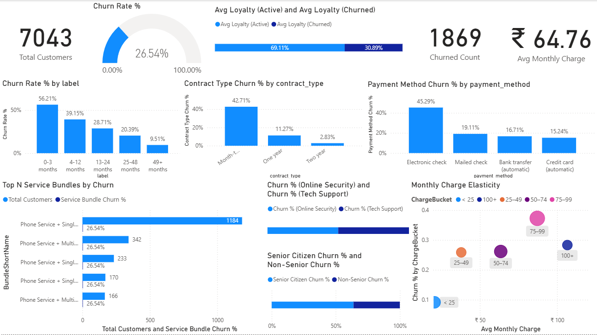

# Telco Customer Churn Analysis  
SQL + Power BI Project

## About the Project

This project analyzes customer churn for a telecom company using the Telco Customer Churn dataset from Kaggle.

The goal was to take raw customer data, structure it properly in a relational database, write SQL queries to answer business questions, and then build a Power BI dashboard to visualize the insights.

This project focuses on understanding why customers leave and what patterns are associated with churn.

---

## Dataset

Dataset: Telco Customer Churn  
Source: Kaggle  
Link: https://www.kaggle.com/datasets/blastchar/telco-customer-churn  

The dataset includes:

- Customer demographics  
- Contract information  
- Services subscribed  
- Billing details  
- Churn status  

---

## What I Did

### 1. Database Setup

- Created a structured database using SQL
- Defined primary keys and relationships
- Organized customer, billing, and service information into tables

File: `SchemaSetup.sql`

---

### 2. SQL Analysis

Wrote SQL queries to calculate:

- Overall churn rate
- Churn by contract type
- Churn by payment method
- Average tenure of churned vs retained customers
- Revenue comparison between churned and active customers
- Service usage patterns linked to churn

File: `Queries.sql`

---

### 3. Power BI Dashboard

Built an interactive dashboard to present:

- Total customers
- Churn percentage
- Revenue breakdown
- Contract type analysis
- Tenure distribution
- Service impact on churn

The dashboard allows filtering by contract type, tenure group, gender, and payment method.

---

## Key Observations

- Customers on month-to-month contracts churn significantly more.
- Customers with shorter tenure are more likely to leave.
- Certain services (like lack of tech support) show higher churn association.
- Revenue impact of churn is substantial when long-tenure customers leave.

---

## Tools Used

- SQL (mention which one you used)
- Power BI
- Data Modeling
- Basic Business Intelligence concepts

---

## How to Run

1. Download the dataset from Kaggle.
2. Run `SchemaSetup.sql` in your SQL environment.
3. Use `Queries.sql` to generate analysis.
4. Open `Dashboard.pbix` in Power BI Desktop.

---

## What I Learned

- How to structure flat data into relational tables
- Writing practical SQL for business metrics
- Turning query outputs into dashboards
- Understanding churn from a business perspective

---

Author: K Nagarjun  
MBA – Business Analytics
